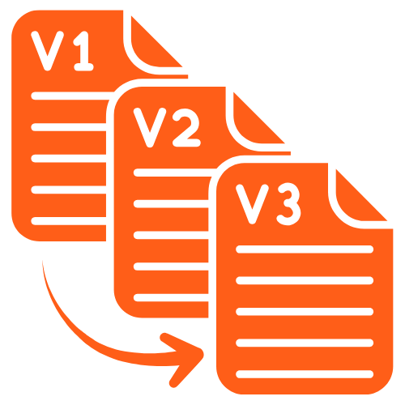

# Git Changelists

<p align="center">
  
</p>

<p align="center">
  <strong>IntelliJ-style changelists for VS Code</strong><br>
  Save snapshots of your changes, switch between versions, and commit selectively.
</p>

<p align="center">
  <a href="https://marketplace.visualstudio.com/items?itemName=harungecit.git-changelists"></a>
  &nbsp;
  <a href="https://github.com/harungecit/git-changelists/releases"></a>
  &nbsp;
  <a href="https://www.apache.org/licenses/LICENSE-2.0"></a>
</p>

---

## Features

| Feature | Description |
|---------|-------------|
| **Snapshot System** | Save the current state of any file without reverting it |
| **Multiple Versions** | Keep different versions of the same file in different changelists |
| **Non-Destructive** | Your working file stays intact - keep editing after saving a snapshot |
| **Diff Preview** | Click any snapshot to see a side-by-side diff with HEAD |
| **Apply & Stage** | Apply a snapshot and stage it for commit in one click |
| **Independent Storage** | Each snapshot stores full content, not diffs - zero corruption risk |
| **Badge Counter** | Activity Bar icon shows total snapshot count |
| **Smart Naming** | Auto-increment suggestions when creating changelists (v1 → v2) |
| **AI Integration** | Add snapshots to VS Code Chat or access via CLI tools |

## Installation

### VS Code Marketplace
1. Open VS Code
2. Go to Extensions (`Ctrl+Shift+X`)
3. Search for **"Git Changelists"**
4. Click **Install**

### GitHub Releases
1. Download the latest `.vsix` file from [GitHub Releases](https://github.com/harungecit/git-changelists/releases)
2. Install via command line:
```bash
code --install-extension git-changelists-1.1.0.vsix
```

## Quick Start

1. **Make changes** to your files as usual
2. **Open Git Changelists** panel from the Activity Bar (left sidebar)
3. **Right-click** a file under "Working Changes"
4. **Select "Shelve to Changelist..."** and choose a changelist
5. **Continue editing** - your file stays as-is!

## Commands

| Command | Description | Shortcut |
|---------|-------------|----------|
| Create Changelist | Create a new changelist group | `Ctrl+Shift+N` |
| Shelve to Changelist | Save current file state as snapshot | `Ctrl+Shift+M` |
| Restore to Working | Replace working file with snapshot | - |
| Apply & Stage | Apply snapshot and stage for commit | - |
| Apply All & Stage | Apply all snapshots from changelist | - |
| Delete Snapshot | Remove a saved snapshot | - |
| Add to Chat | Add file/snapshot to VS Code Chat | - |
| Preview | View diff between HEAD and snapshot | Click on snapshot |

## Workflow Example

```
Working on a feature and need to try different approaches?

1. Edit config.json (original → version A)
2. Save to "Approach A" changelist        ← Snapshot saved, file unchanged
3. Continue editing (version A → version B)
4. Save to "Approach B" changelist        ← Another snapshot saved
5. Compare both approaches by clicking each snapshot
6. Decide version A is better
7. Click "Apply & Stage" on Approach A    ← File restored & staged
8. Commit!
```

## Smart Changelist Naming

When creating a new changelist, the extension suggests the next name automatically:

| Existing | Suggestion |
|----------|------------|
| (none) | `v1` |
| `v1` | `v2` |
| `version 1` | `version 2` |
| `version_1` | `version_2` |
| `feature-3` | `feature-4` |

Just press **Enter** to accept or type your own name.

## AI/CLI Tool Integration

### Add to Chat
Right-click any snapshot or working file and select **"Add to Chat"** to add it to VS Code's Chat panel (works with GitHub Copilot and other chat extensions).

### CLI Tool Access
Enable `saveSnapshotsToFile` setting to save snapshots as real files in `.gitchangelists/` folder. This allows CLI-based AI tools like **Claude Code**, **Gemini Code**, etc. to access your snapshots directly.

```
.gitchangelists/
├── v1/
│   └── config.json
├── v2/
│   └── config.json
└── .gitignore
```

## Settings

| Setting | Description | Default |
|---------|-------------|---------|
| `gitChangelists.showEmptyChangelists` | Show changelists with no files | `true` |
| `gitChangelists.autoRefreshOnSave` | Auto-refresh when files are saved | `true` |
| `gitChangelists.confirmBeforeCommit` | Show confirmation before committing | `true` |
| `gitChangelists.confirmBeforeRevert` | Show confirmation before reverting | `true` |
| `gitChangelists.saveSnapshotsToFile` | Save snapshots to `.gitchangelists/` for CLI tools | `false` |
| `gitChangelists.enableVersionComparison` | Enable version comparison features | `false` |

## Version Comparison (Experimental)

Compare multiple versions of the same file across different changelists.

### Enable Feature
1. Open Settings (`Ctrl+,`)
2. Search for "Git Changelists"
3. Enable **"Enable Version Comparison"**

### Features
- **Compare with...** - Compare snapshot with HEAD, Working file, or other snapshots
- **Compare All Versions** - Select any two versions to compare side-by-side

### How to Use
1. Right-click a snapshot in any changelist
2. Select **"Compare with..."** to compare with:
   - HEAD (latest committed version)
   - Working (current file in working directory)
   - Other snapshots of the same file
3. Or select **"Compare All Versions"** to pick any two versions

## How It Works

Unlike traditional shelve/stash systems that store diffs, Git Changelists saves **complete file content** for each snapshot:

- **No Corruption** - Snapshots are independent of HEAD changes
- **Multiple Versions** - Same file can exist in different changelists with different content
- **Instant Switching** - Restore any version immediately
- **Safe Storage** - Snapshots persist across VS Code sessions

## Requirements

- VS Code 1.85.0 or higher
- Git installed and configured

## Contributing

Contributions are welcome! Please feel free to submit a [Pull Request](https://github.com/harungecit/git-changelists/pulls) or open an [Issue](https://github.com/harungecit/git-changelists/issues).

## Author

**Harun Gecit**

* 💻 **Web:** [harungecit.dev](https://harungecit.dev)
* 📧 **Email:** info@harungecit.com
* 🐙 **GitHub:** [@harungecit](https://github.com/harungecit)
* 💼 **LinkedIn:** [harungecit](https://linkedin.com/in/harungecit)
* 📸 **Instagram:** [@harungecit.dev](https://instagram.com/harungecit.dev)

---

**License:** [Apache 2.0](LICENSE)
